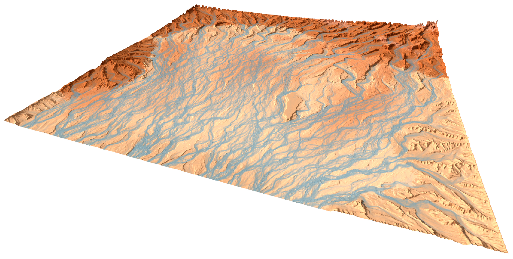

# soillib

soillib is a library and toolbox for numerical geomorphology simulation on the GPU

Written in in C++23 + CUDA and exposed to Python3 through nanobind

Maintained by [erosiv](https://erosiv.studio). Based on concepts developed by and maintained by [Nicholas McDonald](https://github.com/weigert).

Tested on Windows and Linux.

<p align="center">

</p>

#### Related Work

- [Stochastic Geomorphological Transport for Terrain Erosion Simuluation](https://erosiv.studio/publications/stochastic-geomorphological-transport)
- [geotransport](https://github.com/erosiv/geotransport): Companion Repository for Stochastic Geomorphological Transport
- [SimpleHydrology](https://github.com/weigert/SimpleHydrology): Early momentum conserving erosion model.

## Description

`soillib` is a unified C++23 library for numerical geomorphology simulation, with a Python3 layer built on top. The library is designed with a high degree of compatiblity with Python in mind.

`soillib` provides modularized and unified concepts for many aspects of geomorphological simulations, from high-performance indexing structures to unified particle physics and unified data import and export interfaces, including native `GeoTIFF` support.

`soillib` is fully statically typed in C++, while allowing for dynamic types in the python interface. It achieves this through a selector pattern, which generates statically typed code for all permitted types (constrained by concepts), while choosing these paths dynamically. This leads to deep inlining and full static performance benefits.

This allows for creating complex geomorphological simulations through elegant modular concepts in Python. All examples are implemented in Python, but are equally reproducible in C++.

`soillib` is interoperable with popular Python packages like numpy and pytorch, making it easy to integrate into new or existing projects quickly. 

`soillib` is inspired by a number of predecessor systems and the difficulty of maintaining them all at the same time as concepts evolve. This allows for the maintenance of a single library, and re-implementing these programs on top of this library easily.

#### Features / Highlights

- GPU First Kernelized Erosion Models
- A Library of Kernelized Operations for Numerical Geomorphology
- Fully Statically Typed C++23 Library with Concepts
- Dynamically Typed Python Module
- Interoperability with Numpy / PyTorch
- Unified image import / export, including floating-point `.tiff` data and native GeoTIFF support.

#### Why C++23?

Concepts and type constraints are extremely convenient for defining complex operations which can be implemented for certain map and cell types, without becoming too specific.

Additionally, the introduction of "deducing this" in `C++23` as well as the convenient `std::format` and `std::print` are features that reduce design complexity of the library.

## Installation and Usage

Install through [pypi.org](https://pypi.org/project/soillib/) using `pip` (w. dependencies):

```bash
pip install erosiv-silt soillib
```

Import into your python project:

```python
import soillib as soil
```

## Building from Source

After cloning, update your git submodules:

```bash
git submodule update --init --recursive
pip install .
```

Build from source and install from this repository using `pip`:

```bash
pip install .
```

Re-building for development:

```bash
pip install --no-build-isolation -ve .
```

Build directly using CMake:

```bash
cmake -S . -B build
cmake --build build
```

Build Wheel Distributable:

```bash
pip wheel .
```

### Dependencies

- [silt (is submodule)](https://github.com/erosiv/silt)
- LibTIFF (is submodule)
- nanobind (is submodule)
- CUDA Toolkit
- CMake
- Python3
- Scikit (pip)