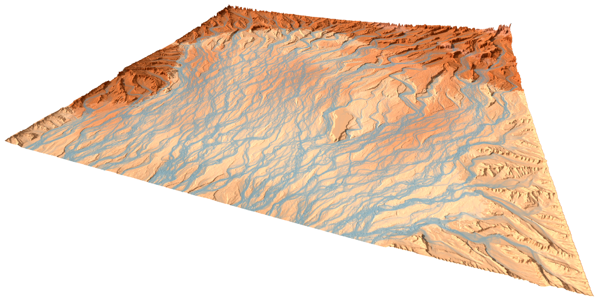

soillib
=======

.. Pull the project overview straight out of README.md rather than restating
   it. Duplicated prose drifts: the copy nobody is currently editing goes
   stale silently. The markers below are HTML comments in README.md.

   The :parser: option takes a MODULE name, not a class path -- docutils
   imports the named module and uses its `Parser` attribute. myst_parser
   ships myst_parser.sphinx_ as a shim for exactly this. Requires
   docutils >= 0.17.

.. include:: ../README.md
   :parser: myst_parser.sphinx_
   :start-after: <!-- doc:overview-start -->
   :end-before: <!-- doc:overview-end -->

.. toctree::
   :maxdepth: 2
   :caption: Contents:

   api_cpp
   api_python
